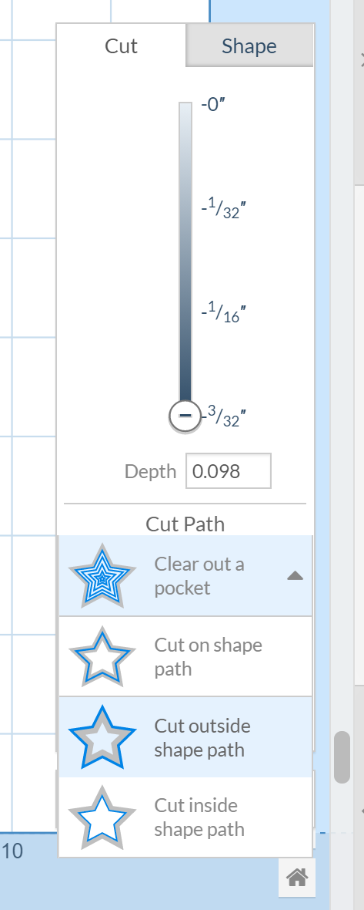
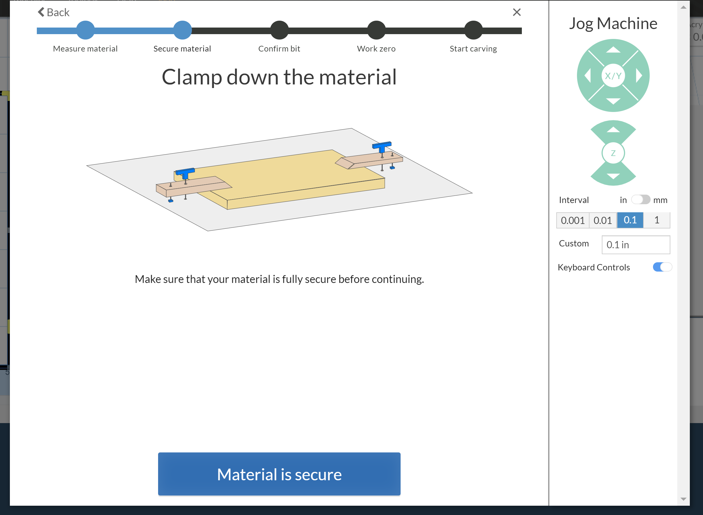
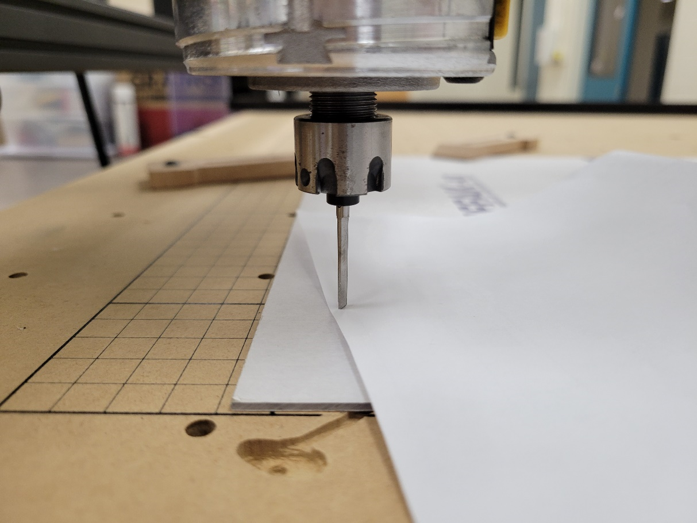
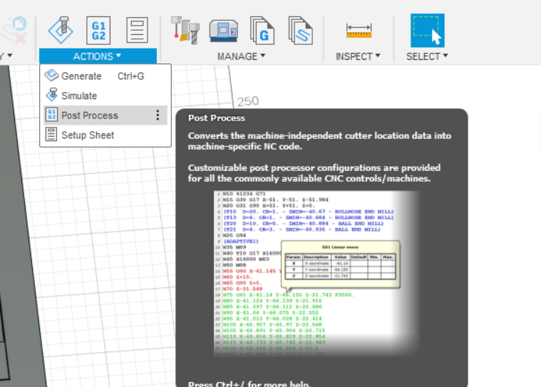

X-Carve CNC Router
======================

Installing Easel Post Processor
-------------------------------

This tutorial will walk you through the process of installing the Easel Post Processor. This post processor is required to use the X-Carve CNC Router. 

1)	Launch Easel, navigate to File -> Import G-Code 

2)	The menu below will appear. Before you import your part, you’ll need to download and install the post processor. Select Autodesk 360 and choose your device (i.e. Mac or PC) 

3)	Next launch Autodesk 360. Go to the Fusion 360 Account Ribbon on the top right corner of your screen and select preferences
 

4)	Go to the left-hand bar and select Manufacture, then select the check box “enable cloud libraries”. Press Apply, then OK. 
 

5)	Next you need to navigate tot eh fusion 360 online portal. Go to File, then select “View Details on Web” 
 

6)	This will bring you to the part page, click the “home” button to navigate to the main menu. 
 
 .. figure:: ../_static/images/X6.png
    :figwidth: 450px
    :target: ../_static/images/X6.png

7)	Navigate to the menu named “assets” 

.. figure:: ../_static/images/X7.png
    :figwidth: 450px
    :target: ../_static/images/X7.png

8)	The CAMPosts folder holds the post processors for Fusion 360. Upload the Easel Port Processor file we downloaded earlier to this folder.  

 .. figure:: ../_static/images/X8.png
    :figwidth: 450px
    :target: ../_static/images/X8.png
 
9)	Now the Easel post processor will be available for you to use in Fusion 360
This tutorial was generated using the following video: 
https://youtu.be/DFwXdnKzg2I

Changing the Router Bit
-------------------------------

CRITICAL! UPLUG THE ROUTER. 
Safety Reminder: Router bits are very sharp, only handle the bits with cut proof gloves. 
To remove the bit from the router you will need to press the small yellow button on bottom right hand side of the router (just above the router). While depressed, this button locks the rotation of the router. 

 .. figure:: ../_static/images/X9.png
    :figwidth: 450px
    :target: ../_static/images/X9.png

Using the spanner wrench shown in the photo below (while holding the button in) loosen the router mount by turning the spanner counter clockwise (CCW).

 .. figure:: ../_static/images/X10.png
    :figwidth: 450px
    :target: ../_static/images/X10.png

 .. figure:: ../_static/images/X11.png
    :figwidth: 450px
    :target: ../_static/images/X11.png

The router mount does not need to be removed fully, unless you’re using a bit with a larger shank. In which case the collet would also need to be replaced (inside the router mount). It’s been removed in the photo below to show the collet. The collet is used to hold the bit in place and can be replaced to use bigger (or smaller) bits. The bit can travel freely in the collet until the router mount is tightened. 

 .. figure:: ../_static/images/X12.png
    :figwidth: 450px
    :target: ../_static/images/X12.png

Slide the old bit out of the collet and slide the new bit into the collet. To ensure you’re using the intended bit you can check the color (per the bit guide link) or check the top of the color for the bit description. 

 .. figure:: ../_static/images/X13.png
    :figwidth: 450px
    :target: ../_static/images/X13.png

 .. figure:: ../_static/images/X14.png
    :figwidth: 450px
    :target: ../_static/images/X14.png

The bit should slide freely in the collet. Slide the router mount back onto the router router and twist it into place. The bit should move freely in the collet until the clearance between the router mount and the router is approximately 0.3”. 

 .. figure:: ../_static/images/X15.png
    :figwidth: 450px
    :target: ../_static/images/X15.png

After this point you can still twist the router mount but you’ll notice increasing friction on the shank of the router bit. Move the bit up into the collar until the spacer stops it from moving further, and then hand tighten it until its snug. The bit will no longer slide easily up and down in the router mount. 

 .. figure:: ../_static/images/X16.png
    :figwidth: 450px
    :target: ../_static/images/X16.png

Next use the spanner to tighten the router mount in place. Similar to when you were removing the mount, hold the yellow button to stop the router from rotating. 

 .. figure:: ../_static/images/X17.png
    :figwidth: 450px
    :target: ../_static/images/X17.png

That’s it! You’ve changed the bit! 

Machine Set-Up
-------------------------------

Setting up the X-Carve
The fist step to using the X-Carve will be installing the Easel Driver on your computer. You’ll be prompted to download the driver when you press Carve:

 .. figure:: ../_static/images/X18.png
    :figwidth: 450px
    :target: ../_static/images/X18.png

 .. figure:: ../_static/images/X19.png
    :figwidth: 450px
    :target: ../_static/images/X19.png
  
After the driver is installed, you can plug the USB connection from the X-Carve DC P/S Interface into your computer. Power on the Interface (make sure the toggle is in the ON position before you do).

 .. figure:: ../_static/images/X20.png
    :figwidth: 450px
    :target: ../_static/images/X20.png

Press the Carve button in Easel. If the machine does not connect automatically you’ll need to identify which COM port your USB is connected to. Open the Device Manager on your PC.

 .. figure:: ../_static/images/X21.png
    :figwidth: 450px
    :target: ../_static/images/X21.png

Look for the section labelled Ports (COM & LPT). A connected device will be clear to read, while unused ports will be opaque. In this case we’re connected to COM port 4. Enter 4 on the Easel connection screen to connect to X-Carve. 
Now you’ll have control of the machine! 
By clicking the Green Arrow button at the top of the screen you’ll be able to jog the router. Now you can move the router around the bed by using the arrow keys (you’ll need to toggle that on as shown in the screenshot below. 

 .. figure:: ../_static/images/X22.png
    :figwidth: 450px
    :target: ../_static/images/X22.png

Try jogging the router around the bed!
Next press the Carve Button. You will be prompted to set up the machine. 

 .. figure:: ../_static/images/X23.png
    :figwidth: 450px
    :target: ../_static/images/X23.png

Press set up your machine, this X-Carve was purchased in 2017, so select the appropriate set up: 

 .. figure:: ../_static/images/X24.png
    :figwidth: 450px
    :target: ../_static/images/X24.png

Enter the following settings:

X-Carve
X-Controller
1000mm x 10000mm
ACME Threaded Rod 
DeWalt 611
Dust Shoe = Yes 

 Next you’ll need to confirm the machine is wired correctly by jogging it. Press the indicators and confirm that the machine moves correctly in the X – Y – Z directions. 
 
 .. figure:: ../_static/images/X25.png
    :figwidth: 450px
    :target: ../_static/images/X25.png

The router on this machine has been set up manually (this means it must be adjusted at the top of the router). You will set up the router to confirm manual operation. There is a speed chart for corresponding numerical values to RPM in the X-Carve Bit Guide. 

 .. figure:: ../_static/images/X26.png
    :figwidth: 450px
    :target: ../_static/images/X26.png

This machine does not have homing switches. 
 
This machine does have a Z-Probe
 
Now you’re done the basic set-up! You can now start carving!

Test Cut
-------------------------------
For our test cut we’re going to be using 1/8” particle board. The X-Carve default is shown below: 

 .. figure:: ../_static/images/X27.png
    :figwidth: 450px
    :target: ../_static/images/X27.png

Some important things to note: 
You need to adjust the size of your stock (length / width / thickness)
You need to secure your stock 
You need to determine your zero position 
You need to adjust the depth of each profile cut 

First you need to measure your stock.
Grab the measuring tape from the toolbox and do a check of your material size: 
 
 .. figure:: ../_static/images/X28.png
    :figwidth: 450px
    :target: ../_static/images/X28.png
 
 .. figure:: ../_static/images/X29.png
    :figwidth: 450px
    :target: ../_static/images/X29.png

The effective stock size we have for this cut is 31” x 16” (at 1/8” thick)

Next we need to secure the stock. 

You can secure the stock to the bed by using the provided wooden clamps. There is a grid pattern throughout the table with threaded inserts to all the clamps to be mounted. Secure the part from all four sides using a M5 hex key. If it not possible to secure the material from all four sides then an alternative clamping method must be used. 
Make sure that the clamps stop the stock from moving, and they are applying downward force on the stock. If you’re not sure if your stock is secure, try pushing it firmly from all four sides in various places. If the material can shift then you need to secure the material differently. 
You’ll notice another issue with the way the example above is secured. The bottom left and right corners aren’t secured. Given this is a thin piece of material, there is a chance for the material to rise as the router is cutting. This will cause the machine to lose position, spoiling your material and leaving a poor cutting finish. For thin materials, it’s best to screw them directly to the spoil board, or use double sided tape. 
For a better overview of securing a part to the router bed, see the “Setting Up the Evo-One Tutorial”. 

Next we need to identify the zero position. 

This will be done as part of your “Carve” operation. First position your part on the stock. Easel will preview the cut on the right side of the screen. Ensure your cut fits inside the material. 

 .. figure:: ../_static/images/X30.png
    :figwidth: 450px
    :target: ../_static/images/X30.png

Press Carve. Easel will ask you to confirm your material thickness. Measure the thickness with a set of calipers to ensure you’ve entered the right value. 

 .. figure:: ../_static/images/X31.png
    :figwidth: 450px
    :target: ../_static/images/X31.png
 
Next confirm the part is secured. As mentioned above, try your best to move the stock. If it can shift “AT ALL” then the part needs to be secured again. 
Then easel will ask you to confirm the bit to be used. For this cutting operation we’re going to use the 2 Flute UpCut Bit. For details on bits see the X-Carve Bit Guide (link). 

 .. figure:: ../_static/images/X32.png
    :figwidth: 450px
    :target: ../_static/images/X32.png 

If you need to change the bit, go back to “Changing the Router Bit”.

Next you’ll need to zero your machine. Here are some best practices for zeroing the machine: 
Try to position the bit as close to the bottom left corner of the stock as possible
Leave enough clearance on the X and Y axis to ensure that the router will not collide with the clamps. Best practice is to measure how far onto the part the clamps are to avoid hitting them. 

 .. figure:: ../_static/images/X33.png
    :figwidth: 450px
    :target: ../_static/images/X33.png 

Use a piece of paper when determining your Z zero. Slowly lower the resolution of the movement until the paper doesn’t move between steps. Alternatively, use the included Z-Probe.

 .. figure:: ../_static/images/X34.png
    :figwidth: 450px
    :target: ../_static/images/X34.png 

Now you’re ready to start carving!

Router Details
-------------------------------

.. figure:: ../_static/images/35.png
    :figwidth: 450px
    :target: ../_static/images/35.png

Using Easel for Simple Cuts
-------------------------------

This section of the tutorial will cover doing basic cuts with Easel. This requires no machining toolpaths, so basic shapes can be cut out of material stock with minimal programming. 
Start by defining your material in Easel. Define the width, length, and thickness of the stock. 

 
Draw your simple shape on the bed. Below you can see a simple rectangle. 

 
Define the profile size and position. You can do this by defining the exact size of the material. Then using the position section you can position the part on the bed relative to the bottom left corner of the bed (on your screen). 

On the Cut Tab, define the depth of the cut you’d like to perform. This can be adjusted to a precise value, or use the depth slider. The depth slider is helpful as it gives you an indication how deep the cuts will be from 0 to full depth. 
You can also specify the cut behavior here. It’s important to consider the diameter of the bit being used. If you cut on the line expect the center point of the bit to travel on the line, this will lose some material from the inside and outside. To ensure the dimensional accuracy of your part, it’s best to cut on the outside of the line. 

Tabs are a helpful addition to any cut as they ensure that the part being removed stays stationary relative to the stock. They can be removed manually after the cut is complete. You can define the size of the tabs (as well as the number). 

.. figure:: ../_static/images/X40.png
    :figwidth: 450px
    :target: ../_static/images/X40.png

Your pattern is now ready to be cut! Follow the steps below to start your cut. 
Confirm the thickness of your part. This can be done using a set of calipers (or a measuring tape for thicker stock). 

Confirm material is secured to the table. You shouldn’t be able to move the stock in the x or y axis. All edges should be secure so the material can’t move in the Z-axis while being cut. In the case shown below, the part is adequately secured in the X-Y plane. However, if the router moves to close to the corners further from the clamps there’s a risk the material will rise as it’s being cut (throwing off cut quality and dimensional accuracy). Securing this thin piece could be improved through using double sided tape (or by screwing it to the spoil board). 

To ensure the spindle doesn’t collide with the clamps, we measured their distance from the origin (the bottom left corner). We have enough clearance with this cut, so we won’t hit the clamps. 

Another consideration is that the spindle won’t collide with the clamps (or other securing devices). This is an important consideration while doing your zeroing. Think about how the material is secured, often the clamps and other devices can be applied without being in the cut path. 
Confirm the bit to be used. Standard X-Carve bits are available from the drop down menu. 

Before starting this cut you need to define the zero position for the machine. The X-Carve remembers the last specified origin for the machine. To determine your zero location jog the spindle to an “appropriate” starting location for your cut. The X-Carve will always behave relative to the bottom left corner on the bed shown in Easel. 

When defining the zero position for your z-axis, a good tip is to use a piece of paper. Place the paper between the bit and the material and gently move the paper back and forth. Lower the spindle until you start to feel friction between the bit and the paper. When the paper catches you’ve reached the top of the stock. 

Raise the bit by clicking the on screen prompt. This will give some clearance from the z-axis for the spindle to move into position. However, it doesn’t move up enough to clear a clamp, you need to make sure the clamps are not in the path of the spindle to the cutting location on the stock. The x-carve will lose its position if it collides with something (or hangs up). Which may result in a failed cut. 

.. figure:: ../_static/images/X49.png
    :figwidth: 450px
    :target: ../_static/images/X49.png

Next turn on the spindle by pressing the power button on the machine. You’ll also be able to adjust the machine speed here. The dial can be adjusted from 1 (slow) to 6 (high). A chart dictating the RPM for each value can be found at (link to Bit guide). 

Press Carve and watch the machine cut!

Importing G-Code to Easel
---------------------------------

Before starting this tutorial, please ensure that the Easel post processor is installed in Fusion 360. 

1)	Now that the Easel post processor is installed you can export G-Code from Fusion 360 to Easel. Launch Fusion 360 and navigate to you part under the “manufacture” menu. 
Note: this tutorial assumes you’ve already created a machining toolpath in Fusion 360 to export. To create a toolpath for your part, please see the Fusion360 tutorial.

2)	 You will now have access to the “Actions” menu at the top of your screen. Select Actions  Post Process 

3)	Under the Post Process Menu you’ll see the following window. If you’ve installed the post processor correctly you should be able to select the option “Easel by Inventibles / easel” option from the drop down. 

4)	After you select the Easel post processor update the Program Name to reflect the operation you’re going to complete. Also you can update the output file path for the .nc file. 

IMPORTANT NOTE: Easel can only handle one operation at a time! You will need to export each CNC cutting operation as a separate file.

5)	Now that you have your .nc file, Launch Easel in your browser. Navigate to File and Select “import G-Code”. Press choose file and navigate to the G-Code you generate in Fusion360. 

6)	This will now launch the G-Code in Easel. Easel will then run a simulation of the cut you’re completing on the stock that you specified in your Fusion 360 Set-up. It will import the bit dimensions that you specified as well
   

7)	Now that you’ve got your toolpath imported into Easel, it’s time to get carving! Proceed to the next tutorial for details on setting up the machine and starting your cut. 

NOTE: Remember! Your exported G-Code assumes that the diameter of the bit you’re using in Fusion 360 matches the bit you’re going to use on the router. Using a different sized bit will result in a failed cut (dimensionally). 
