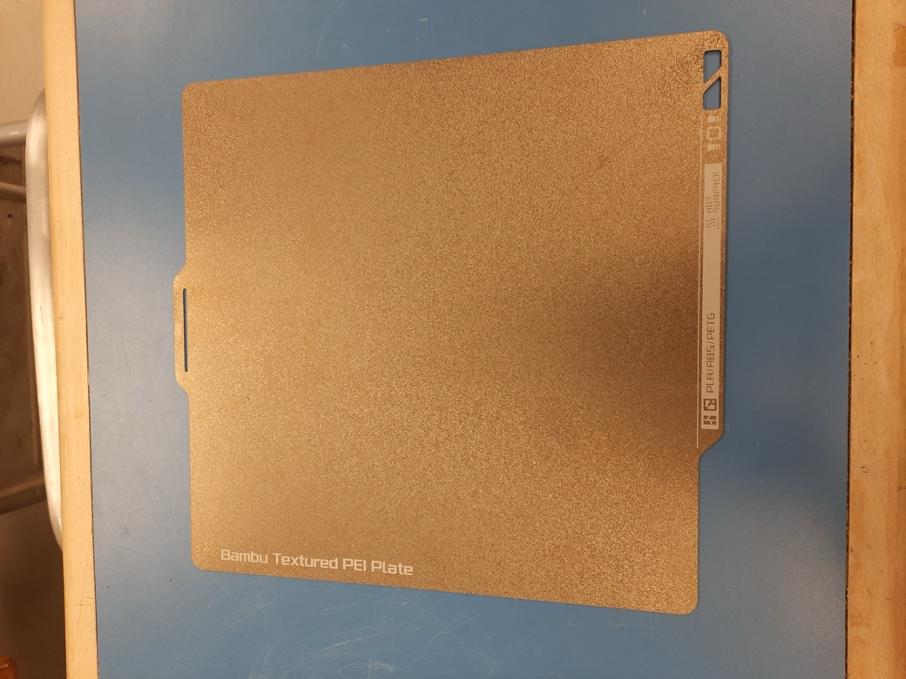

Table of Contents
=================

`Step 1: Downloading Bambu Studio <#step-1-downloading-bambu-studio>`__
`2 <#step-1-downloading-bambu-studio>`__

`Step 2: Configuring Bambu Studio <#step-2-configuring-bambu-studio>`__
`2 <#step-2-configuring-bambu-studio>`__

`Step 3: Slicing STL File <#step-3-slicing-stl-file>`__
`3 <#step-3-slicing-stl-file>`__

`Step 4: Slicing and Exporting <#step-4-slicing-and-exporting>`__
`5 <#step-4-slicing-and-exporting>`__

`Step 5: Setting up Bambu <#step-5-setting-up-bambu>`__
`6 <#step-5-setting-up-bambu>`__

`Tips and Tricks <#_Toc160631625>`__ `9 <#_Toc160631625>`__

Step 1: Downloading Bambu Studio
================================

First step to using Bambu P1S is to download the Bambu Studio as it is a
proprietary software. You can download it
`here <https://bambulab.com/en/download>`__. Install the correct
application for your respective operating system.

Step 2: Configuring Bambu Studio
================================

Start by clicking on ‘\ *New Project’* as shown below.

.. image:: vertopal_c7eab9f72a144cc8ad1f7b261756c178/media/image1.png
   :width: 6.49449in
   :height: 4.05906in

Figure 1: Bambu studio home screen.

Next, select the correct printer type: **Bambu Lab P1S 0.4 Nozzle. IF
THE WRONG PRINTER IS SELECTED, IT WILL DAMAGE THE PRINTER**

.. image:: vertopal_c7eab9f72a144cc8ad1f7b261756c178/media/image2.png
   :alt: A screenshot of a computer Description automatically generated
   :width: 5.81944in
   :height: 1.76389in

Figure 2: Correct printer type.

Step 3: Slicing STL File
========================

You are now ready to slice your STL file. Import or drag the STL file
into Bambu Studio by clicking *File Import* *Import
3MF/STL/STEP/SVG/OBJ/AMF…* |A screenshot of a computer Description
automatically generated|

Figure 3: Importing STL File

.. image:: vertopal_c7eab9f72a144cc8ad1f7b261756c178/media/image4.png
   :alt: A screenshot of a computer Description automatically generated
   :width: 6.5in
   :height: 4.0625in

Figure 4: Imported Part

Use the options in the top to orient your model to lay flat on the bed
and in an orientation that will minimise the use of supports. If
supports are required, then enable them from the *“Support”* tab.

.. image:: vertopal_c7eab9f72a144cc8ad1f7b261756c178/media/image5.png
   :alt: A screenshot of a computer Description automatically generated
   :width: 6.5in
   :height: 4.0625in

Figure 5: Enabling Supports

Click on the *“Strength”* tab to change infill percentage (most prints
will do will with 10-20% infill).

.. image:: vertopal_c7eab9f72a144cc8ad1f7b261756c178/media/image6.png
   :width: 2.53367in
   :height: 2.65432in

Figure 6: Setting Infill Percentage

Step 4: Slicing and Exporting 
==============================

Now hit *“Slice plate”* on the top of the screen.

.. image:: vertopal_c7eab9f72a144cc8ad1f7b261756c178/media/image7.png
   :width: 6.5in
   :height: 4.0625in

Figure 7: Sliced Plate

Click on the drop-down arrow and click *“Export all sliced file”*

.. image:: vertopal_c7eab9f72a144cc8ad1f7b261756c178/media/image8.png
   :alt: A screenshot of a computer Description automatically generated
   :width: 6.5in
   :height: 2.57222in

Figure 8: Exporting File

Transfer the file to the SD Card and you are now ready to head over and
start printing!

Step 5: Setting up Bambu
========================

Turn on the printer on the bottom left corner on the back of the printer
and place the filament in the spool holder. When printing, use your own
filament and do not use any that is not permissible to be used. `Bambu
PLA <https://ca.store.bambulab.com/products/pla-basic-filament>`__ and
`ESUN
PLA+ <https://www.amazon.ca/1-75mm-Black-Printer-Filament-2-2lbs/dp/B01EKEMDA6/ref=sr_1_11?crid=WJ6WAH6ONA0X&dib=eyJ2IjoiMSJ9.UikmRW7fvnnRUWXATZwe-va6pwSST4q-UL6KmphWGCGxhKYkR3gHF6q2yyKYtawryuuBDggr2jAthrTkCXTzpN2dpySL4NSPfvI3FqjqMnhns9Gm-uAncVic0w_Qh913dktfzHCyMC2sphKdfrpSiDdY_NpIf1pEAnoIs6pA25DvSILgjhwbuDE6SW2Cxc_jgGW-JRCsAqh8zidYJRzg7_6ydpf8Zdv8rijA4JEVaZ5-bd1ylNgi9Ab1Fsou4GLnHaI89MRpy-WzyUsQJofyuqF7wpy-i7WhdRofx1MfxNM.hLuOSTXyF4VlU-pFQ6mu7RwBl8WPah4r3xRHakgJCVo&dib_tag=se&keywords=esun+pla+plus&qid=1709750917&sprefix=esun+pla+plu%2Caps%2C116&sr=8-11>`__
are the recommended filaments. You can also buy them locally from
`COLEMAN3D <https://coleman3d.ca/>`__.

.. image:: vertopal_c7eab9f72a144cc8ad1f7b261756c178/media/image9.jpeg
   :alt: A black computer with a roll of wire Description automatically
   generated
   :width: 3.78698in
   :height: 2.84023in

Figure 9: On/Off switch and spool holder.

Click on the second option on the left column and then click
*“Feeding”*.

.. image:: vertopal_c7eab9f72a144cc8ad1f7b261756c178/media/image10.jpeg
   :alt: A close up of a machine Description automatically generated
   :width: 3.33684in
   :height: 2.50263in

Figure 10: Loading Display I

Hit *“L*\ o\ *ad”* and insert filament from the back. Keep hitting retry
until the old filament has been removed and your filament colour is
clean.

.. image:: vertopal_c7eab9f72a144cc8ad1f7b261756c178/media/image11.jpeg
   :alt: A close up of a machine Description automatically generated
   :width: 3.33681in
   :height: 2.5026in

Figure 11: Loading Display II

Once your filament has been successfully loaded, click on the
4\ :sup:`th` option the left column to access the file. Find your file
name and select print. DO NOT PUT GLUE ON THE PLATE. IT IS A TEXTURED
PLATE AND DOES NOT REQUIRE GLUE.

Figure 12: Textured Plate

.. image:: vertopal_c7eab9f72a144cc8ad1f7b261756c178/media/image13.jpeg
   :alt: A close up of a machine Description automatically generated
   :width: 3.50526in
   :height: 2.62895in

Figure 13: Print Dialogue

I\ |A close up of a machine Description automatically generated|

Figure 14: Printing Dialogue II

Congratulations your model is now printing!

.. |A screenshot of a computer Description automatically generated| image:: vertopal_c7eab9f72a144cc8ad1f7b261756c178/media/image3.png
   :width: 6.5in
   :height: 2.27708in
.. |A close up of a machine Description automatically generated| image:: vertopal_c7eab9f72a144cc8ad1f7b261756c178/media/image14.jpeg
   :width: 3.53684in
   :height: 2.65263in
